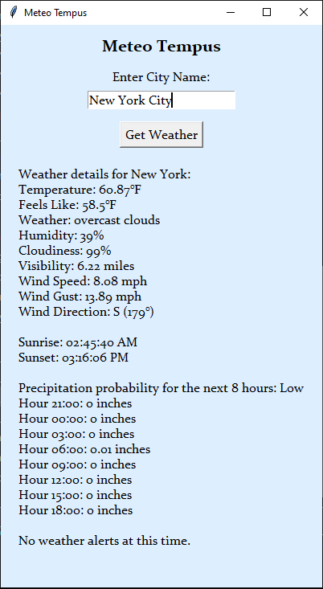

# ☁️ Meteo Tempus – Python Weather Forecast App

A fully-featured weather forecast app built with Python and Tkinter. It fetches live forecast data using the OpenWeatherMap API and presents it in a user-friendly GUI.

---

### 🌦 Features

- 🌡️ Temperature, feels like, humidity, and weather conditions
- 🌅 Sunrise and 🌇 sunset times adjusted for the city’s local timezone
- 🌬️ Wind speed, direction (with compass labels), and gusts
- 🌧️ Precipitation forecast by hour for the next 8 hours (rain or snow)
- 🚨 Weather alerts when available
- 📊 Probability-based precipitation rating: Low / Medium / High
- ✨ Simple, styled GUI using `tkinter`

---

### 📸 Screenshot




---

### ▶️ How to Run

1. **Clone this repository**:

   ```bash
   git clone https://github.com/W-Riley-01/Weather_API.git
   cd Weather_API


